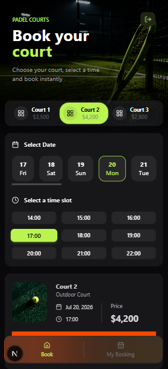
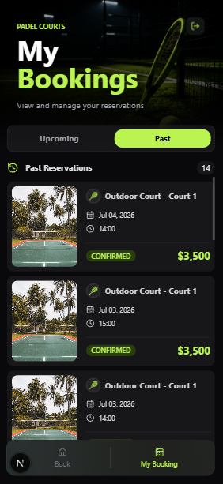
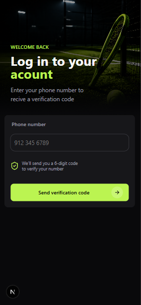
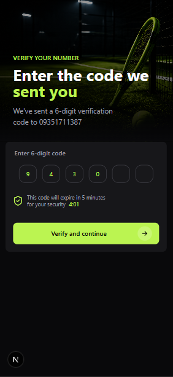
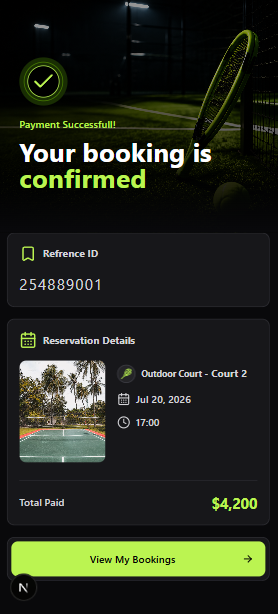
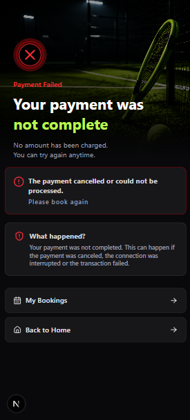

# 🏓 Padel Booking System

A modern full-stack padel court booking application built with **Next.js**, **TypeScript**, **MongoDB**, and **React Query**.

Users can authenticate with OTP, reserve courts, complete online payments via ZarinPal, and manage their bookings through a clean and responsive interface.




---

## ✨ Features

- OTP Authentication
- JWT & Protected Routes
- Court Booking
- Real-time Slot Availability
- ZarinPal Payment Integration
- Payment Verification
- My Bookings
- Admin Court Management
- Responsive UI

---




## 🚀 Tech Stack

**Frontend**

- Next.js 15
- React
- TypeScript
- Tailwind CSS
- shadcn/ui
- React Query

**Backend**

- Next.js Route Handlers
- MongoDB
- Mongoose
- JWT Authentication

---

## 📦 Installation

```bash
git clone https://github.com/mehrbod1384/padel-booking-system.git
```

```bash
cd padel-booking-system
```

```bash
npm install
```

```bash
npm run dev
```

---

## 🔑 Environment Variables

```env
DATABASE=

JWT_SECRET=

ZARINPAL_MERCHANT_ID=

NEXT_PUBLIC_APP_URL=
```

---

## 📋 Booking Flow

```text
Login
   ↓
Choose Court
   ↓
Choose Date & Time
   ↓
Online Payment
   ↓
Payment Verification
   ↓
Reservation Confirmed
```

---




## 📄 License

This project is built for educational and portfolio purposes.

---

**Developed by Mehrbod Moteghaedi**
